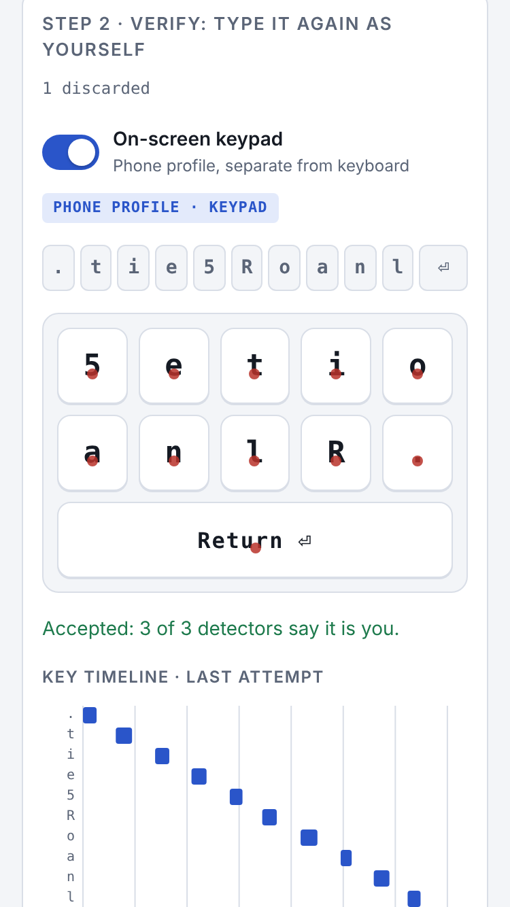
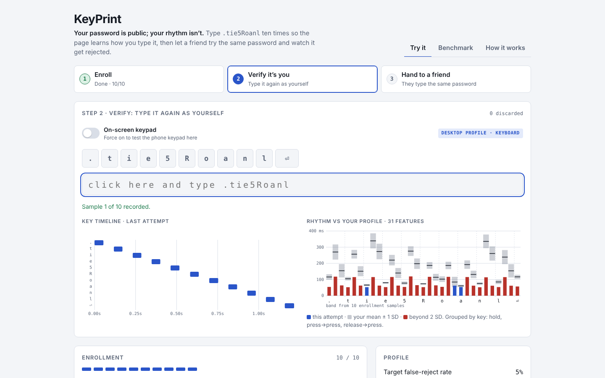

# KeyPrint

**Your password is public; your rhythm isn't.** KeyPrint learns how you type a passphrase and rejects anyone else typing the same one. One HTML file, plain JavaScript, no libraries, and nothing leaves your browser.

**Live demo:** https://iamgokuld.github.io/keyprint/


<!-- TODO: record docs/demo.gif (enroll 10×, verify, hand to a friend) -->

## Try it

1. **Enroll.** Type `.tie5Roanl` then Return, 10 times, at your natural pace.
2. **Verify.** Type it again. Three detectors score the attempt against your profile.
3. **Hand to a friend.** They type the same password. The Me / Someone-else tally counts false rejects and false accepts.

Works with a physical keyboard on desktop and with an on-screen keypad on phones (see [On a phone](#on-a-phone)). Typos, Backspace, a wrong tap or clicking away discard the attempt. Profiles are kept in `localStorage` and can be exported as JSON. Milestone 1 exports (`schema: 1`) and M1's `keyprint.v1` storage are imported automatically.

## On a phone

| Phone, 375 × 667 (keypad, tap dots from the last attempt) | Desktop, 1440 × 900 |
|---|---|
|  |  |

Soft keyboards give unreliable key timings (many fire keydown and keyup together when the finger lifts), so on a touch screen KeyPrint shows its own keypad for `.tie5Roanl` + Return and never opens the system keyboard.

- **Capture.** `pointerdown` / `pointerup` with `e.timeStamp`: hold = down → up, DD and UD as on a keyboard, so the same 31 timing features. Overlapping taps (multi-touch) are allowed and matched by `pointerId`. Same rules as desktop: taps before “.” are ignored, a wrong key or a cancelled touch discards the attempt and bumps the reject counter.
- **Tap position.** Each tap also records its offset from the key centre, normalised to key size (−0.5 … +0.5, x and y): 22 more features, 53 in total. The detectors take vectors of any length, so the frozen `KP-DETECTORS` block is unchanged.
- **Separate profiles.** Phone and keyboard profiles are stored under different keys with `device` in the JSON, and are never compared. A switch (“On-screen keypad”) forces the keypad on a desktop for testing; it is labelled as testing mode, since mouse clicks are not finger taps.
- **Layout.** 360 px phones to wide desktops with no horizontal page scroll (wide tables scroll in their own box), touch targets ≥ 44 px, safe-area insets, portrait and landscape, light and dark. Canvases redraw on `ResizeObserver` and render at `devicePixelRatio`.

**Does tap position help?** Unknown yet: the CMU benchmark is keyboard-only. `bench-mobile.js` computes per-volunteer EER with timing only (31) and timing + position (53): train on reps 1–10, test on reps 11–20 and the first 5 reps of every other volunteer.

```sh
node bench-mobile.js --synthetic --per-user   # synthetic volunteers: pipeline check
```

Synthetic volunteers only (20 users, seed 1, `bench-mobile-results.json`); these show that the pipeline works, **not** that position helps on real phones:

| Detector | Timing only (31) | Timing + position (53) | Users better / worse |
|---|---|---|---|
| Scaled Manhattan | 0.240 (0.090) | 0.152 (0.060) | 15 / 4 |
| Mahalanobis | 0.203 (0.084) | 0.146 (0.083) | 17 / 3 |
| Nearest neighbor | 0.212 (0.081) | 0.160 (0.091) | 12 / 6 |

With `--pos 0` (tap position carries no identity) the extra 22 features cost a little instead (Manhattan 0.240 → 0.242, Mahalanobis 0.203 → 0.216), which is the outcome real data could also show. Real numbers will replace this table once volunteer data is in.

## How it works

**31 features.** Each attempt of the 11 keys (`.tie5Roanl` + Return) becomes 11 hold times (H, key down → up), 10 press-to-press latencies (DD) and 10 release-to-press latencies (UD = DD − H, negative when keys overlap), in seconds and in the CMU dataset's column order. Timestamps come from `KeyboardEvent.timeStamp`; keyups are matched by physical key (`e.code`).

**Three detectors** (`KP-DETECTORS` block in `index.html`), each a pure `train(samples)` / `score(model, x)` pair:

| Detector | Score |
|---|---|
| Scaled Manhattan | Σ \|x − μ\| / MAD (mean absolute deviation, floored at 1 ms) |
| Mahalanobis | √((x − μ)ᵀ Σ\*⁻¹ (x − μ)) |
| Nearest neighbor | min over training samples of the Mahalanobis distance, same Σ\* |

The page accepts when at least 2 of 3 detectors are under their threshold.

**Shrinkage covariance.** With 10 samples in 31 dimensions the sample covariance has rank ≤ 9 and cannot be inverted. KeyPrint uses Σ\* = (1 − λ)·C + λ·diag(C), with λ from the Schäfer–Strimmer estimator (target D, clipped to [0.05, 1]) and variances floored at 1 ms², then inverts by Cholesky.

**Leave-one-out thresholds.** Each detector is trained on 9 of the 10 enrollment samples and scores the held-out one. The threshold is the linearly interpolated (1 − target FRR) quantile of those 10 scores; the default target is 5% and a slider sets 0–30%.

## Results

CMU Keystroke Dynamics Benchmark, 51 subjects × 400 repetitions of `.tie5Roanl`. Protocol of Killourhy & Maxion (2009): per subject, train on the first 200 reps; test on the last 200 genuine reps and the first 5 reps of each of the other 50 subjects (250 impostor attempts). EER is the point where FAR = FRR on the ROC, linearly interpolated. Mean (SD) over subjects:

| Detector | KeyPrint EER | Killourhy & Maxion EER |
|---|---|---|
| Scaled Manhattan | 0.096 (0.069) | 0.096 (0.069) |
| Nearest neighbor (Mahalanobis) | 0.097 (0.062) | 0.100 (0.064) |
| Mahalanobis | 0.108 (0.064) | 0.110 (0.065) |

Scaled Manhattan reproduces the paper exactly. The small gains on the two Mahalanobis detectors come from the shrunk covariance.

**Enrollment size.** Same test set, training on the first *n* reps. Mean EER, with the held-out false-reject rate at a 5% target threshold in brackets:

| Training reps | Scaled Manhattan | Mahalanobis | Nearest neighbor |
|---|---|---|---|
| 5 | 0.257 (23.1%) | 0.229 (9.5%) | 0.230 (9.4%) |
| **10 (the demo)** | **0.230 (17.4%)** | **0.209 (8.1%)** | **0.209 (7.9%)** |
| 20 | 0.197 (19.2%) | 0.184 (11.2%) | 0.179 (11.5%) |
| 50 | 0.154 (15.4%) | 0.162 (9.3%) | 0.155 (9.7%) |
| 100 | 0.124 (6.6%) | 0.130 (5.2%) | 0.124 (5.6%) |
| 200 | 0.096 (4.8%) | 0.108 (4.5%) | 0.097 (5.3%) |

Ten reps give about twice the error of 200. A 95th percentile estimated from 10 leave-one-out scores is noisy and biased low, and 10 reps typed in one sitting miss session-to-session drift, so the false-reject rate only approaches its target at ≥ 100 reps. (Thresholds use leave-one-out up to 50 reps and 10-fold above.)

Reproduce:

```sh
./scripts/get-data.sh                     # downloads the CSV from cs.cmu.edu/~keystroke and checks its MD5
node bench.js DSL-StrongPasswordData.csv  # ~25 s; prints both tables, writes bench-results.json
node bench.js DSL-StrongPasswordData.csv --embed   # also refreshes the results embedded in index.html
```

The Benchmark tab shows ROC curves, the enrollment curve and per-subject EERs, and can rerun the whole benchmark in a Web Worker from a CSV you drop on the page.

## Tests

```sh
node test_detectors.js   # features, 6 synthetic typists, shrinkage, EER edge cases, detector-block freeze
node test_capture.js     # capture rules: clock, stray keys, chords, Shift-before-R, spoil + counter,
                         # keys after all 11 are down, M1 import/migration, rhythm stats
node test_touch.js       # keypad: 31 + 22 features, offsets, multi-touch, wrong key, cancel, 53-dim detectors,
                         # synthetic volunteers (position helps only when it carries signal)
npm i -D playwright && node test_e2e.js
                         # Chromium: real touch input at 375×667 (DPR 2) -> 53 features, overlap -> negative UD,
                         # enroll + verify, canvas DPR + resize, ≥ 44 px targets,
                         # no horizontal scroll at 360/375/667/1440; keyboard + forced keypad at 1440×900; screenshots
```

Tests load the code straight out of `index.html` (blocks marked `KP-DETECTORS`, `KP-CAPTURE`, `KP-TOUCH`, `KP-BENCH`), so there is no build step and nothing to keep in sync. GitHub Actions runs them on every push; `pages.yml` deploys `main` to GitHub Pages after they pass.

## Files

| File | Purpose |
|---|---|
| `index.html` | The whole app: capture, detectors, benchmark viewer, embedded results |
| `bench.js` | Command-line benchmark using the same code |
| `bench-results.json` | Output of `bench.js` on the CMU data (also embedded in the page) |
| `bench-mobile.js` | Phone benchmark: timing-only vs timing + tap position |
| `bench-mobile-results.json` | `bench-mobile.js --synthetic` output (synthetic, see above) |
| `test_*.js`, `test_util.js` | Node tests, no dependencies (`test_e2e.js` needs Playwright) |
| `docs/screenshots/` | Phone and desktop screenshots written by `test_e2e.js` |
| `scripts/get-data.sh` | Downloads the CMU CSV (not committed) |

## Limitations

- **Session drift.** Typing rhythm changes across days, keyboards, posture and mood. A profile from one sitting rejects you more often later.
- **Small enrollment.** 10 samples keep the demo quick but give about twice the benchmark error of 200, and the 5% false-reject target is not met (see above).
- **Not production authentication.** One fixed passphrase, no liveness or replay protection, no adaptation over time, and profiles stored unencrypted in the browser. Use it to learn about keystroke dynamics, not to protect anything.
- **Phone results are unvalidated.** The tap-position features have only been tested on synthetic data so far. The forced keypad on a desktop (mouse clicks) is for testing the plumbing, not for real profiles.

## Roadmap

- Gather real phone sessions and publish real `bench-mobile.js` numbers.
- Template adaptation: fold accepted attempts back into the profile to track drift.
- Score fusion beyond majority vote, and per-user threshold tuning from more enrollment data.

## Credits and citation

Benchmark data: **CMU Keystroke Dynamics Benchmark Data Set**, Kevin S. Killourhy and Roy A. Maxion, Carnegie Mellon University, https://www.cs.cmu.edu/~keystroke/. The data are not redistributed here; `scripts/get-data.sh` downloads them from the source. The authors ask that users cite the paper:

> K. S. Killourhy and R. A. Maxion, "Comparing Anomaly-Detection Algorithms for Keystroke Dynamics," in *Proc. 39th Annual IEEE/IFIP International Conference on Dependable Systems and Networks (DSN 2009)*, Lisbon, Portugal, June 29 – July 2, 2009, pp. 125–134. doi:[10.1109/DSN.2009.5270346](https://doi.org/10.1109/DSN.2009.5270346)

Shrinkage estimator: J. Schäfer and K. Strimmer, "A Shrinkage Approach to Large-Scale Covariance Matrix Estimation and Implications for Functional Genomics," *Statistical Applications in Genetics and Molecular Biology* 4(1), 2005.

## License

MIT. See [LICENSE](LICENSE). The CMU dataset is not covered by this license.
